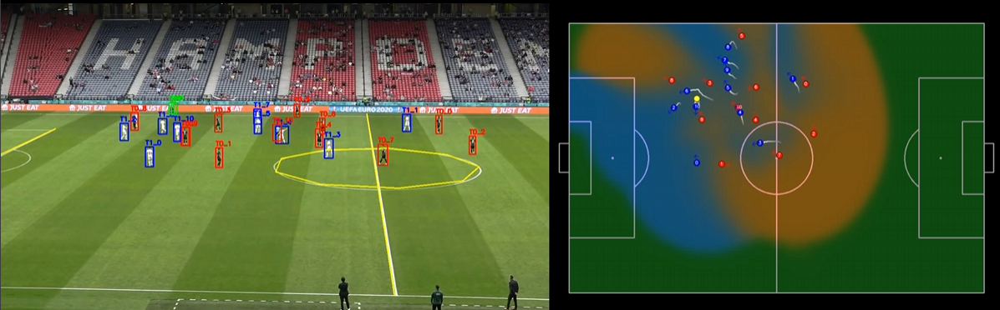

# torchkick

A Computer vision toolkit for football video analysis. Detects players, tracks them across frames, and projects positions onto a 2D pitch map. Personal project that may or may not turn useful one day.



## Install

```bash
pip install -e .
```

For CUDA 12.8 (recommended):
```bash
uv pip install -e . --extra-index-url https://download.pytorch.org/whl/cu128
```

## Usage

Analyze a match video:
```bash
torchkick analyze -v match.mp4 --duration 60
```

Different detector backends:
```bash
torchkick analyze -v match.mp4 --model-type yolo
torchkick analyze -v match.mp4 --model-type fcnn
torchkick analyze -v match.mp4 --model-type rtdetr
``` 

Or use the Python API:
```python
from torchkick import run_analysis

output = run_analysis("match.mp4", model_type="fcnn", duration=60.0)
```

I've yet to release model weights, but still actively refining approach on homography projection and player tracking, so this can heavily change from current structure (also, not so sure whether it will even make it to the public).

## What it does

1. Detects players using YOLO/FCNN/RT-DETR
2. Tracks them with IoU matching or BotSORT
3. Estimates camera homography from pitch lines
4. Projects player positions to pitch coordinates
5. Classifies teams by jersey color
6. Outputs a video with 2D pitch visualization

## Training

Train your own models on SoccerNet data:
```bash
torchkick train yolo --data soccernet/tracking/train.zip
torchkick train fcnn --epochs 10
torchkick train lines --data calibration_data/
```

I'm actively working on getting more high quality data for player tracking (not just frame detection), re-identification, and semantic segmentation for the field / line prediction. so, if you have anything to contribute with in that direction I'm all ears :)

## License

MIT